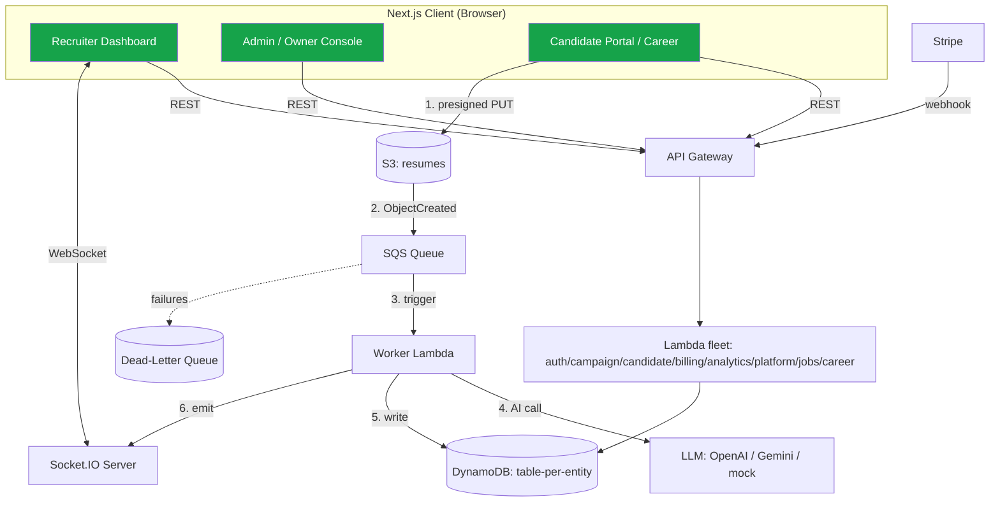
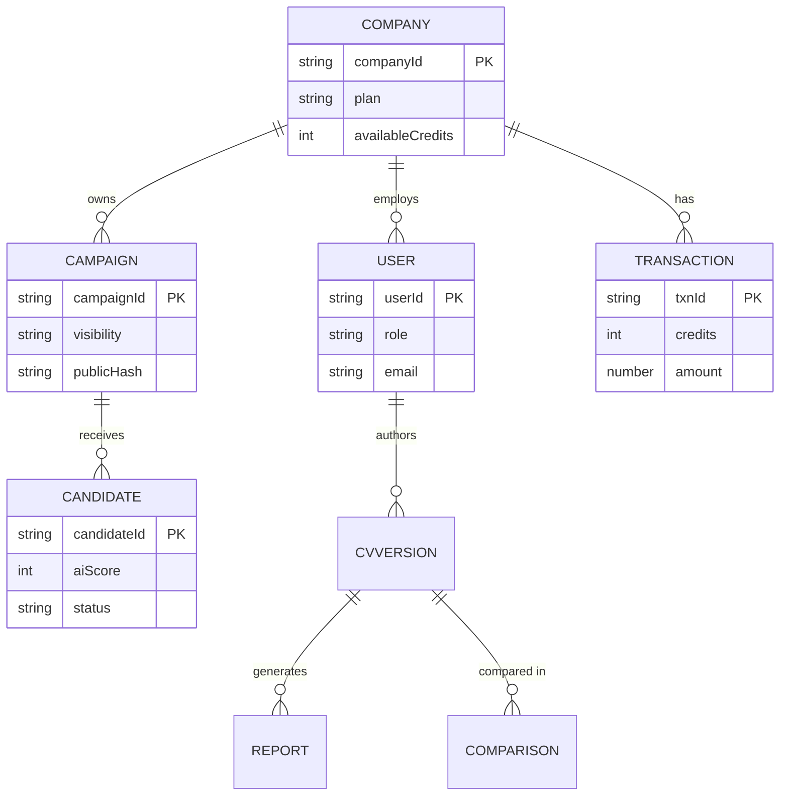
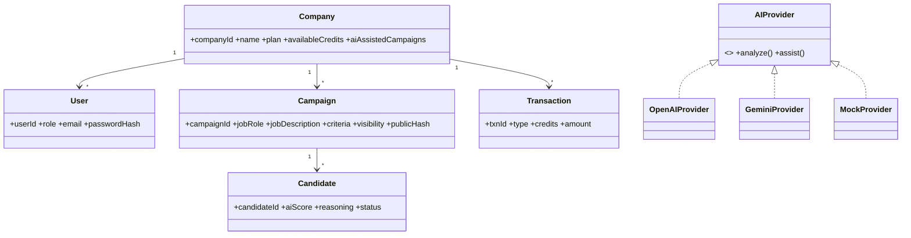

<!--
============================================================================
 DOCUMENT FORMATTING GUIDE  (delete this comment block before submission)
============================================================================
 This report is authored in Markdown so the structure, headings and tables
 stay clean. To produce the final professional Word/PDF document:

 RECOMMENDED TYPOGRAPHY (University-grade)
   • Body font ........ Times New Roman, 12 pt, 1.5 line spacing, justified
       (alternative: Calibri 11 pt / Cambria 12 pt)
   • Heading 1 (#) .... Times New Roman, 16 pt, Bold
   • Heading 2 (##) ... Times New Roman, 14 pt, Bold
   • Heading 3 (###) .. Times New Roman, 13 pt, Bold
   • Captions ......... 10 pt, Italic, centered (Figure X / Table X)
   • Margins .......... 1 inch all sides; page numbers bottom-centre
   • Code/monospace ... Consolas 10 pt

 CONVERT MARKDOWN -> WORD (keeps headings as Word styles, auto TOC):
     pandoc FYP_FINAL_REPORT.md -o Hiretics_FYP.docx --toc --toc-depth=3 \
            --reference-doc=university_template.docx
   Then in Word: References ▸ Update Table (TOC), and apply the cover page.

 DIAGRAMS: see "Appendix C — Diagram Production Guide" at the end for every
 figure, the AI tool to make it, and ready-to-render Mermaid/PlantUML code.
============================================================================
-->

# Final Year Project Report

## Project Name
**Hiretics — An Event-Driven, Queue-Based Serverless Architecture with Microservices-Style Domain Decomposition, Emulated Locally via LocalStack**

**Project Advisor:** Sir Hafiz Ahsan Arshad
**Co-Advisor:** Sir Awais Amin

**Submitted By:**

| Name | Roll Number |
|------|-------------|
| Muhammad Abubakar | F2022266276 |
| Muhammad Ibrahim | F2022266385 |
| Eman Fatima | F2022266766 |
| Syeda Asfoora Iqbal | F2022266102 |

**Session:** 2022 – 2026

**University of Management and Technology**
C-II Johar Town, Lahore, Pakistan
Department of Informatics & Systems — School of Systems & Technology

---

## Dedication

We dedicate this Final Year Project, first and foremost, to our **beloved parents**, whose unconditional love, prayers, and sacrifices have been the foundation of every achievement in our lives. Their constant encouragement gave us the strength to persevere through the most demanding phases of this work.

We dedicate it to our **respected teachers and mentors**, especially our project advisor **Sir Hafiz Ahsan Arshad** and co-advisor **Sir Awais Amin**, whose knowledge, patience, and guidance shaped both this project and us as engineers.

We dedicate it to our **families and friends**, who supported us with patience and belief during the countless hours this project demanded.

Finally, we dedicate this work to every **organization, recruiter, and job seeker** striving to make hiring fairer, faster, and more accessible — and to the open-source and cloud-engineering community, whose tools made an ambitious cloud-native architecture achievable at zero infrastructure cost. May this effort be a small but sincere contribution toward technology that serves people with honesty and merit.

---

## Final Approval

This is to certify that the project titled **"Hiretics — An Event-Driven, Queue-Based Serverless Architecture with Microservices-Style Domain Decomposition, Emulated Locally via LocalStack"** submitted by the above-named students has been evaluated and found satisfactory for the requirements of the degree.

```
Head of Department ______________________
Department of Informatics & Systems
School of Systems & Technology, UMT Lahore


Director (Final Year Projects – CS) ______________________
Department of Computer Science
School of Systems & Technology, UMT Lahore


Supervisor ______________________
Department of Informatics & Systems
School of Systems & Technology, UMT Lahore


Co-Supervisor ______________________
```

---

## Acknowledgment

All praise and gratitude belong to Almighty Allah for granting us the strength, patience, and guidance to complete this Final Year Project.

We express our sincere gratitude to our project advisor **Sir Hafiz Ahsan Arshad** and co-advisor **Sir Awais Amin** for their continuous guidance, technical insight, and encouragement throughout the development of this work, which kept us aligned with professional engineering and research standards.

We thank the faculty of the **University of Management and Technology (UMT)** for providing the academic foundation and supportive environment that made this project possible. We also acknowledge the open-source and cloud communities — especially the teams behind **LocalStack, the Serverless Framework, AWS Lambda/SQS/S3/DynamoDB, Next.js, and the OpenAI and Google Gemini APIs** — whose tools made an ambitious cloud-native architecture achievable at zero infrastructure cost for academic development.

---

## Project Summary

**Project Title:** Hiretics — An Event-Driven, Queue-Based Serverless Architecture with Microservices-Style Domain Decomposition, Emulated Locally via LocalStack.

**Objective:** To design, build, and validate a production-grade, **event-driven serverless software architecture** for an AI-powered, two-sided recruitment and career platform that achieves a *scale-to-zero* cost model, decouples workloads through message queues, and isolates concerns into independently deployable functions — fully emulated locally on LocalStack.

**Undertaken By:** Muhammad Abubakar, Muhammad Ibrahim, Eman Fatima, Syeda Asfoora Iqbal.

**Supervised By:** Sir Hafiz Ahsan Arshad (Co-Advisor: Sir Awais Amin).

**Starting Date:** October 2025  **Completion Date:** July 2026.

**Tools & Technologies:**
- **Frontend:** Next.js 15 (App Router), React 18, TypeScript, Tailwind CSS, shadcn/ui, Recharts, Framer Motion.
- **Backend (Serverless):** AWS Lambda (Node.js 18) functions, API Gateway, authored with the Serverless Framework.
- **Messaging / Eventing:** Amazon SQS (with Dead-Letter Queues), S3 event notifications.
- **Database:** Amazon DynamoDB (NoSQL, table-per-entity).
- **Object Storage:** Amazon S3 (direct-to-cloud uploads via pre-signed URLs).
- **Cloud Emulation:** LocalStack (Community Edition) on Docker.
- **Real-Time:** Socket.IO (WebSockets).
- **AI/ML:** OpenAI (GPT-4o-mini) with a provider-abstracted fallback to Google Gemini.
- **Payments:** Stripe (credit packs via webhooks).
- **Authentication:** Custom JWT + bcrypt; Role-Based Access Control.

**Operating System:** Windows 10/11, Ubuntu 22.04 LTS (Docker host).

**Documentation:** Architecture & design documents, API reference, user guide, deployment guide, and testing reports.

---

## Abstract

Conventional recruitment platforms suffer from two structural problems: **high operational cost**, caused by monolithic "always-on" server architectures that bill continuously regardless of usage, and **low screening quality**, caused by rigid keyword-matching that rejects qualified candidates and rewards keyword stuffing. This report presents **Hiretics**, a two-sided AI recruitment and career platform built on an **event-driven, queue-based serverless architecture with microservices-style domain decomposition**, emulated locally with **LocalStack** to demonstrate a *scale-to-zero* cost model at no infrastructure expense.

The architecture is the contribution. Candidate résumés are uploaded **directly to object storage** via pre-signed URLs; an **S3 → SQS → Lambda** pipeline then performs asynchronous, semantically-aware scoring using a Generative-AI engine, persists results to a **NoSQL** store, and pushes **real-time** updates to recruiter dashboards over WebSockets. Failures are captured by a **Dead-Letter Queue**, billing is metered through an **atomic credit** mechanism, and tenants are isolated through **JWT-based multi-tenancy and Role-Based Access Control**. The same architecture is reused to power a candidate-facing career-analysis product (merged from "RoleNorth"), an AI-assisted campaign-authoring service, a Stripe-based billing subsystem, and a platform-owner observability dashboard — turning Hiretics into a complete, extensible platform rather than a single application.

The results demonstrate that an event-driven serverless architecture delivers a highly scalable, decoupled, and cost-efficient foundation for modern SaaS, and that the same backbone can serve multiple products (B2B recruitment, B2C career coaching, and an opt-in job marketplace) without re-architecture. The system achieved 100% requirement coverage in functional, accuracy, and correctness testing.

---

## Contents

> *(In the Word document, generate this automatically via References ▸ Table of Contents — depth 3. The structure below mirrors the headings.)*

1. Introduction
2. Domain Analysis
3. Requirements Analysis
4. Data Flow Diagrams
5. System Design
6. Implementation Details
7. Testing
8. Results / Output / Statistics
9. Conclusion
10. Future Work
11. Bibliography
12. Appendix

---

## Definitions and Acronyms

*Table 1: Definitions and Acronyms*

| Acronym | Definition |
|---------|------------|
| UMT | University of Management and Technology |
| AI | Artificial Intelligence |
| LLM | Large Language Model |
| ATS | Applicant Tracking System |
| AWS | Amazon Web Services |
| S3 | Simple Storage Service |
| SQS | Simple Queue Service |
| DLQ | Dead-Letter Queue |
| DynamoDB | Amazon DynamoDB (managed NoSQL database) |
| Lambda | AWS Lambda (serverless, event-triggered compute) |
| API GW | API Gateway |
| IaC | Infrastructure as Code |
| JWT | JSON Web Token |
| RBAC | Role-Based Access Control |
| CORS | Cross-Origin Resource Sharing |
| IDOR | Insecure Direct Object Reference |
| GSI | Global Secondary Index (DynamoDB) |
| DFD | Data Flow Diagram |
| UML | Unified Modeling Language |
| ERD | Entity Relationship Diagram |
| CV | Curriculum Vitae |
| OCR | Optical Character Recognition |
| SaaS | Software as a Service |
| B2B / B2C | Business-to-Business / Business-to-Consumer |
| MRR | Monthly Recurring Revenue |
| UUID | Universally Unique Identifier |
| FYP | Final Year Project |

---

## List of Figures

- Figure 1: System Use-Case Diagram
- Figure 2: Data Flow Diagram — Level 0 (Context)
- Figure 3: Data Flow Diagram — Level 1
- Figure 4: Data Flow Diagram — Level 2 (CV Processing Pipeline)
- Figure 5: System Architecture Diagram (Event-Driven Serverless)
- Figure 6: Class Diagram (Domain Model)
- Figure 7: Sequence Diagram — Asynchronous CV Ranking Pipeline
- Figure 8: Sequence Diagram — Stripe Credit Purchase (Webhook)
- Figure 9: Sequence Diagram — Candidate CV Analysis & Tailor-to-Job
- Figure 10: Collaboration Diagram — Campaign & Ranking
- Figure 11: Entity Relationship Diagram (ERD)
- Figure 12: Deployment Diagram (LocalStack / Docker)

## List of Tables

- Table 1: Definitions and Acronyms
- Table 2: Feature Comparison with Other Platforms
- Table 3: System Requirements
- Table 4: List of Actors
- Table 5: List of Use Cases
- Table 6: Data Dictionary
- Table 7: Extended Test Cases
- Table 8: Decision Table
- Table 9: Traceability Matrix (RID vs UCID)

---

# 1. Introduction

The inefficiencies of conventional hiring were addressed by **Hiretics**, an event-driven, web-based recruitment and career platform whose primary contribution is its **software architecture**. The project delivers an automated, affordable means of screening and ranking résumés by employing a **serverless, queue-based, event-driven design** — emulated on LocalStack — and integrating Generative AI for semantic analysis. This document describes the architectural decisions, the implementation, and the testing outcomes that demonstrate the viability of a true "pay-as-you-go" model for contemporary SaaS applications.

## 1.1 Motivations

The principal motivation behind Hiretics is the **operational inefficiency** of conventional hiring platforms. Most existing systems are built on monolithic architectures that demand "always-on" servers; their owners pay high fixed costs regardless of usage. This financial burden both blocks smaller agencies from entering the market and forces higher subscription fees onto clients.

A second motivation is **screening quality**. Traditional keyword-matching algorithms reject highly competent individuals simply because their résumés omit specific buzzwords, while permitting unqualified applicants to pass through "keyword stuffing."

This project was selected to show that **both** problems can be solved at once by an event-driven, serverless architecture. By modeling a cloud environment in which compute resources **scale to zero** while idle, Hiretics keeps operating costs to a minimum; by integrating Generative AI (OpenAI GPT-4o-mini, with a Google Gemini fallback), it makes hiring merit-driven rather than keyword-driven. A third motivation emerged during the project: the realization that the *same* architecture could serve candidates directly — analyzing and improving their CVs — turning a one-sided ATS into a **two-sided platform** with strong network effects.

## 1.2 Project Overview

Hiretics is a web-based platform that combines **Generative AI** with a **serverless cloud architecture**. It serves three audiences from one architectural backbone:

1. **Companies & Recruiters (B2B):** create recruitment campaigns, receive applications, and review AI-ranked candidates with explainable scores.
2. **Candidates & Job-Seekers (B2C):** upload a résumé to receive an executive-grade career report (CV improvement suggestions, skill-decay radar, automation-exposure analysis, career-pivot paths, a 30-60-90 action plan, and market signals), track CV versions over time, and **compare** versions to measure progress.
3. **Platform Owner (Operator):** monitors the live infrastructure, manages tenants, oversees billing/revenue, and operates the processing pipeline (including DLQ retries).

Candidates upload PDF résumés **directly to cloud storage**, which triggers an automated, **event-driven analysis pipeline**. Unlike rigid keyword ATS tools, Hiretics uses an LLM to **semantically** evaluate candidates against job descriptions, producing a merit-based suitability score (0–100) with a written justification.

The backend is implemented as a fleet of **AWS Lambda functions**, decomposed by bounded context (auth, campaign, candidate, worker, credits/billing, recruiters, analytics, platform, jobs, and candidate-career services), fronted by a single **API Gateway**, and connected by **SQS** queues and **S3** events. Data is persisted in **DynamoDB** (table-per-entity) and files in **S3**. The entire AWS stack is emulated by **LocalStack** in Docker — an "architecture-first" approach that is highly scalable and cost-efficient, eliminating idle infrastructure cost for the platform owner.

**Key system functions:**
- Secure campaign management with hashed, enumeration-proof public links and **opt-in publishing** to a job marketplace.
- Direct-to-cloud résumé upload (pre-signed URLs) that bypasses the application tier.
- **Asynchronous, queue-decoupled** AI ranking with Dead-Letter-Queue resilience.
- Real-time recruiter dashboards via WebSockets.
- AI-assisted campaign authoring (title, description, and scoring-criteria generation).
- Two-sided candidate career analysis and CV-to-job tailoring that reuses the recruiter's scoring criteria.
- Credit-based, pay-as-you-go billing via Stripe with atomic, race-safe deduction.
- A platform-owner observability and tenant-management console.

**System attributes:** high availability, event-driven scalability, multi-tenant data isolation, explainable AI, and a pay-as-you-go cost model.

## 1.3 Problem Statement

The recruitment industry faces two compounding problems. **First**, traditional platforms rely on monolithic, always-on infrastructure, forcing owners to incur high fixed costs irrespective of usage volume — restricting scalability and profitability. **Second**, prevailing ATS tools use rigid keyword matching that is fundamentally flawed: it rejects qualified candidates lacking specific terms and admits unqualified applicants through keyword stuffing. Separately, **candidates lack affordable, intelligent tooling** to understand and improve how their CV will be evaluated by such systems.

This dual failure — high operational cost and low screening accuracy, plus an underserved candidate side — creates a clear need for a **cost-efficient, serverless, semantically-intelligent, two-sided** solution. Hiretics addresses this need through its event-driven serverless architecture and integrated Generative AI.

## 1.4 Objectives

The primary objective is to **design and validate a production-grade, event-driven serverless architecture** that eliminates idle infrastructure cost while improving screening accuracy and serving both recruiters and candidates. Specific objectives:

1. **Implement a scale-to-zero architecture** — a fully event-driven backend on Lambda, SQS, S3, and DynamoDB (emulated on LocalStack) that incurs zero compute cost when idle.
2. **Decouple workloads with queues** — process résumés asynchronously through SQS with Dead-Letter-Queue resilience, so spikes never block users.
3. **Integrate semantic AI ranking** — replace keyword matching with LLM-based scoring against structured, weighted criteria, returning explainable results.
4. **Provide real-time feedback** — push live updates to recruiter dashboards via WebSockets the instant a CV is scored.
5. **Enforce secure multi-tenancy and RBAC** — JWT auth, company-scoped data isolation, role hierarchy (Platform Owner, Company Admin, Recruiter, Candidate), and cryptographically-hashed public links to prevent IDOR/enumeration.
6. **Deliver a pay-as-you-go billing model** — atomic credit metering with Stripe credit-pack purchases confirmed server-side via webhooks, and freemium feature gating.
7. **Extend the architecture to a two-sided platform** — reuse the same event-driven pipeline to power candidate CV analysis, version comparison, and CV-to-job tailoring.
8. **Provide operational observability** — a platform-owner console exposing queue depth, throughput, DLQ retries, tenant management, and revenue.

---

# 2. Domain Analysis

## 2.1 Customer

The primary customers are **Recruitment Agencies**, **HR Departments** of mid-to-large enterprises, **Independent Headhunters**, and — on the B2C side — **individual job-seekers**. These users need a scalable, cost-effective solution to manage high application volumes without the steep fixed costs of traditional enterprise software. The pay-as-you-go credit model particularly appeals to:

- **Startups & SMEs** who need professional hiring tools but cannot justify monthly subscriptions for idle time.
- **High-volume staffing firms** who must process thousands of CVs in peak seasons but scale costs down instantly in quiet periods.
- **Job-seekers** who want affordable, AI-driven feedback to improve their CVs and target specific roles.

## 2.2 Stakeholders

*Stakeholders and their roles in the system:*

| Stakeholder | Role in System |
|-------------|----------------|
| **Platform Owner (Operator)** | Operates the SaaS: monitors infrastructure health (queue depth, throughput, DLQ), manages tenants (suspend/activate, grant credits), and oversees billing and revenue across all companies. |
| **Company Admin** | Manages an organization's account: configures settings, purchases credits, invites/removes recruiters, and oversees all of the company's campaigns. Full RBAC over company data. |
| **Recruiter** | Creates job campaigns, generates secure public links, optionally publishes to the job board, reviews AI-ranked candidates, and receives real-time notifications. |
| **Candidate / Job-Seeker** | Applies to campaigns via secure links or the job board; on the B2C side, analyzes and improves their own CV, tracks versions, and tailors CVs to specific jobs. |
| **AI Engine (LLM)** | Performs semantic ranking, CV analysis, and content generation; returns merit scores and structured feedback. |
| **Payment Processor (Stripe)** | Handles credit-pack purchases and confirms payment server-side via webhooks. |
| **Project Supervisor** | Provides academic guidance, validates the architecture and documentation, and ensures FYP evaluation criteria are met. |

## 2.3 Affected Groups with Social or Economic Impact

- **Recruitment Staff** — significantly reduced manual screening workload; recruiters shift from administrative filtering to high-value candidate engagement. *(Supports the Semantic AI Ranking objective.)*
- **Job Candidates** — fairer, merit-based evaluation rather than rejection for missing keywords; additionally empowered with AI feedback to improve. This reduces bias against those who cannot "beat the ATS." *(Supports the merit-based semantic-analysis objective.)*
- **SME Owners** — access to enterprise-grade AI hiring tools without prohibitive subscriptions, democratizing talent-acquisition technology. *(Fulfills the cost-efficient, scale-to-zero objective.)*

## 2.4 Dependencies / External Systems

| Dependency | Role | Type |
|------------|------|------|
| **LocalStack (AWS emulator)** | Emulates S3, SQS, Lambda, DynamoDB, and API Gateway locally, enabling the scale-to-zero architecture with no cloud cost. | Critical / Infrastructure |
| **OpenAI / Google Gemini API** | Generative-AI engine for semantic résumé scoring, CV analysis, and content generation; returns structured JSON. | Critical / Functional |
| **Stripe** | Payment gateway for credit-pack purchases; confirms payments via webhooks. | Functional / Commercial |
| **Socket.IO (WebSocket)** | Real-time, bi-directional channel delivering "candidate scored" events to dashboards. | Functional / Interface |
| **Docker Engine** | Hosts the LocalStack container and guarantees a consistent environment across machines. | Environmental |

## 2.5 Reference Documents

The following references validated the architectural decisions and cost projections:

- **AWS Lambda Pricing** — confirms the free tier and pay-per-request model, validating the scale-to-zero claim. <https://aws.amazon.com/lambda/pricing/>
- **OpenAI / Google Gemini API Pricing** — per-token cost for semantic analysis, supporting the affordable-AI argument. <https://openai.com/pricing> · <https://ai.google.dev/pricing>
- **LocalStack Feature Coverage** — validates local emulation of S3, SQS, Lambda, DynamoDB, and API Gateway at no cost. <https://docs.localstack.cloud/user-guide/aws/feature-coverage/>
- **Serverless vs. Monolithic Architecture (IBM)** — industry analysis of how serverless lowers Total Cost of Ownership by eliminating idle time. <https://www.ibm.com/topics/serverless>

### 2.5.1 Related Projects

- **Workday HCM** — a comprehensive, enterprise-grade *monolithic* system. Extensive HR features but an always-on architecture with high fixed licensing costs, prohibitive for smaller agencies; screening is largely keyword-based.
- **LinkedIn Recruiter** — the industry standard for sourcing, with a vast database, but an expensive subscription model whose search prioritizes keyword-optimized profiles over semantic merit.
- **Greenhouse / Lever** — modern SaaS ATS platforms with strong UX, but operating on monthly subscriptions, so owners pay even in months with no hiring — failing the scale-to-zero test.
- **RoleNorth (merged)** — an AI career-analysis web app (CV improvement, skill-decay radar, automation exposure, pivot paths, version comparison). Its candidate-facing capabilities were merged into Hiretics to create the B2C side of the platform.

### 2.5.2 Feature Comparison

*Table 2: Feature Comparison with Other Platforms*

| # | Feature | Workday (Enterprise) | Greenhouse (SaaS) | **Hiretics (Proposed)** | Remarks |
|---|---------|----------------------|-------------------|--------------------------|---------|
| 1 | Architecture | Monolithic (always-on) | Microservices (containerized) | **Serverless (event-driven, queue-based)** | Hiretics uses Lambda + SQS on LocalStack for true scale-to-zero. |
| 2 | Cost Model | High fixed licensing | Monthly per-user subscription | **Pay-as-you-go (credit-based)** | Owners pay only when a CV is actually processed. |
| 3 | Screening | Exact keyword (Boolean) | Keyword & filter | **AI semantic ranking (LLM)** | Hiretics understands context; others reject for missing keywords. |
| 4 | Real-Time Feedback | Page refresh / email | In-app notifications | **WebSocket push (instant)** | Dashboards update within milliseconds of scoring. |
| 5 | Candidate Side (B2C) | None | None | **CV analysis, version compare, tailor-to-job** | Two-sided platform; network effects. |
| 6 | Authoring Help | Manual | Templates | **AI campaign authoring** | AI drafts title, description, and weighted criteria. |
| 7 | Deployment | On-prem / private cloud | Managed cloud | **LocalStack emulation** | Complex cloud architecture developed/tested locally at no cost. |

---

# 3. Requirements Analysis

## 3.1 Requirements

*Table 3: System Requirements*

| RID | Description | Category | Attribute | Boundary / Constraint |
|-----|-------------|----------|-----------|------------------------|
| R1.1 | Allow candidates to upload PDF CVs directly to secure cloud storage via public links. | Functional | Direct-to-Cloud Upload | Max 5 MB; PDF only. |
| R1.2 | Extract text and semantically rank CVs against the campaign's job description and weighted criteria. | Functional | AI Processing | Normalized JSON score 0–100 with justification. |
| R1.3 | Push live visual feedback to the recruiter dashboard when a CV finishes processing. | Non-Functional | Responsiveness | WebSocket delivery within 2 s of Lambda completion. |
| R1.4 | Incur zero compute cost when no processing/uploading is occurring. | Non-Functional | Scale-to-Zero | Compute via Lambda invocations only; no persistent servers. |
| R1.5 | Persist candidate metadata, AI scores, and campaign configuration. | Data | NoSQL Storage | DynamoDB, table-per-entity design. |
| R1.6 | Verify and deduct company processing credits before invoking the AI service. | Constraint | Atomic Transaction | DynamoDB conditional update; reject AI if balance is 0. |
| R1.7 | Secure all public campaigns from enumeration and unauthorized access. | Constraint | Security | Cryptographically-hashed UUID links; incremental IDs forbidden. |
| R1.8 | Connect to the Generative-AI API to analyze extracted résumé text. | External Interface | API Integration | Provider-abstracted (OpenAI/Gemini/mock). |
| R2.1 | Authenticate users and enforce role-based access (Platform Owner, Admin, Recruiter, Candidate). | Functional | Auth / RBAC | JWT + bcrypt; company-scoped queries. |
| R2.2 | Isolate every tenant's data so one company can never access another's. | Non-Functional | Multi-Tenancy | All reads/writes scoped by companyId from the JWT. |
| R2.3 | Process failed CV jobs through a Dead-Letter Queue with retry. | Non-Functional | Reliability | Max receive count = 3, then DLQ; operator can re-drive. |
| R3.1 | Allow recruiters to publish campaigns to an opt-in job board; default private. | Functional | Visibility | `private` (link-only) or `public` (listed). |
| R3.2 | Provide AI assistance to author campaign title, description, and weighted criteria. | Functional | AI Authoring | Free for 3 campaigns, then Pro-gated. |
| R4.1 | Purchase processing credits via Stripe, confirmed server-side by webhook. | Functional | Billing | Test mode; atomic credit grant; transaction record. |
| R4.2 | Enforce freemium feature entitlements per plan (Free vs Pro). | Constraint | Entitlements | Server-side check in the relevant Lambda. |
| R5.1 | Let candidates analyze a CV and receive an executive career report. | Functional | Candidate Analysis | Skill decay, automation exposure, pivots, action plan, market signals, CV-surgery. |
| R5.2 | Let candidates upload CV revisions and compare two versions for progress. | Functional | Version Comparison | AI diff with score delta. |
| R5.3 | Let candidates tailor a CV to a specific campaign using its criteria, and see a pre-apply match score. | Functional | Cross-Side | Reuses recruiter scoring criteria. |
| R6.1 | Provide a platform-owner console with infrastructure and tenant observability. | Functional | Observability | Queue depth, throughput, DLQ, tenants, revenue. |

## 3.2 List of Actors

- **Platform Owner (Super Admin):** interacts with the infrastructure/operations layer — monitors global health and usage, manages the LocalStack-emulated environment, suspends/credits tenants.
- **Company Admin:** manages the organizational account — purchases shared credits, configures the plan, and provisions/revokes recruiter access.
- **Recruiter:** the primary operational actor — creates campaigns, generates secure links, publishes jobs, and reviews AI-ranked candidates on a real-time dashboard.
- **Candidate / Job-Seeker:** external actor — uploads résumés to apply, and (B2C) analyzes/improves/compares CVs and tailors them to jobs.
- **AI Engine (LLM):** secondary actor — scores, analyzes, and generates content.
- **Stripe (Payment Processor):** secondary actor — processes payments and emits webhooks.

## 3.3 List of Use Cases

*Table 5: List of Use Cases*

- **UC-1 Create Campaign** — a Recruiter sets up a job posting with weighted criteria and generates a hashed public link.
- **UC-2 Upload CV (Direct-to-Cloud)** — a Candidate submits a PDF directly to S3 via a pre-signed URL.
- **UC-3 Rank Candidate (AI Semantic Analysis)** — the system asynchronously extracts text, deducts a credit, scores via the LLM, and notifies the recruiter.
- **UC-4 View Dashboard (Real-Time)** — a Recruiter reviews live, ranked candidate results.
- **UC-5 Manage Credits & Billing** — an Admin buys credit packs via Stripe; the system grants credits on webhook confirmation.
- **UC-6 Manage Recruiters** — an Admin adds/removes recruiters within the company workspace.
- **UC-7 Monitor Infrastructure** — the Platform Owner views queue depth, throughput, DLQ, tenants, and revenue, and re-drives failed jobs.
- **UC-8 Authenticate & Authorize** — users log in and receive RBAC-scoped tokens.
- **UC-9 AI-Assisted Campaign Authoring** — a Recruiter generates/refines title, description, and criteria with AI.
- **UC-10 Publish to Job Board** — a Recruiter opts a campaign into the public job marketplace.
- **UC-11 Analyze CV (Candidate)** — a Candidate uploads a CV and receives an executive career report.
- **UC-12 Compare CV Versions** — a Candidate compares two CV revisions to measure progress.
- **UC-13 Tailor CV to Job** — a Candidate optimizes a CV against a chosen campaign's criteria and views a pre-apply match score.

## 3.4 System Use-Case Diagram

*Figure 1: System Use-Case Diagram.* **(Render with the Mermaid/PlantUML code in Appendix C, or recreate in Lucidchart/draw.io.)** The diagram associates each actor (Platform Owner, Company Admin, Recruiter, Candidate, AI Engine, Stripe) with the use cases above, with `«include»` relationships from UC-2→UC-3 (upload triggers ranking) and UC-5→UC-8 (billing requires auth).

## 3.5 Extended Use Cases

**Use Case UC-2 — Upload CV (Direct-to-Cloud)**
- **Actors:** Candidate (primary).
- **Description:** A candidate securely uploads a PDF résumé directly to S3 via a hashed campaign link.
- **Trigger:** The candidate clicks "Submit Application."
- **Preconditions:** An active campaign exists; the company has a credit balance > 0; the candidate has a valid PDF.
- **Post-conditions:** *Success* — the PDF is stored in S3 and an event is enqueued to SQS. *Minimal* — the attempt is logged.
- **Normal Flow:** (1) Candidate opens the hashed URL; (2) enters name/email; (3) attaches a PDF; (4) clicks Submit; (5) system validates format/size; (6) system returns a pre-signed S3 URL; (7) the browser uploads directly to S3; (8) a success confirmation is shown.
- **Alternative Flow:** 5a. Validation fails → error shown ("Only PDFs under 5 MB allowed"); resume at step 3.
- **Exceptions:** 7a. Storage unavailable → abort, show "Service Temporarily Unavailable," log for the operator.
- **Special Requirement:** Upload must bypass the application tier (direct-to-S3) to reduce bandwidth/compute cost.
- **Notes:** Bucket CORS must permit browser `PUT`/`OPTIONS`.

**Use Case UC-3 — Rank Candidate (AI Semantic Analysis)**
- **Actors:** System (primary), AI Engine (secondary).
- **Description:** The automated, event-driven process triggered when a CV is uploaded; it extracts text, deducts a credit, scores via the LLM, persists, and notifies the recruiter in real time.
- **Trigger:** SQS receives an `ObjectCreated` event from S3.
- **Preconditions:** A valid PDF exists in S3; the AI API is reachable.
- **Post-conditions:** *Success* — score (0–100) and metadata saved to DynamoDB; recruiter dashboard updated live. *Minimal* — one credit deducted.
- **Normal Flow:** (1) Worker Lambda consumes the SQS message; (2) loads candidate + campaign; (3) performs an **atomic credit deduction**; (4) downloads the PDF from S3; (5) extracts text; (6) sends text + criteria to the LLM; (7) parses the JSON score and reasoning; (8) writes to DynamoDB; (9) emits a WebSocket "candidate scored" event.
- **Alternative Flow:** 3a. Credit check fails → status "Pending Credits"; skip AI; alert the admin.
- **Exceptions:** 5a. Text extraction fails (scanned image) → status "Manual Review"; credit refunded. 6a. AI timeout/error → message returns to SQS; after max retries → **DLQ**.
- **Special Requirement:** Credit deduction must be a strictly atomic conditional update to prevent race conditions under concurrent processing.

**Use Case UC-7 — Monitor Infrastructure**
- **Actors:** Platform Owner (primary).
- **Description:** The operator observes the live serverless infrastructure and manages tenants and operations.
- **Normal Flow:** (1) Operator authenticates as Super Admin; (2) views global KPIs (companies, users, CVs processed, revenue); (3) views the **Infrastructure Monitor** (SQS depth, throughput, DLQ count, Lambda metrics, storage); (4) inspects the DLQ and **re-drives** failed jobs; (5) manages tenants (suspend/activate, grant credits).
- **Special Requirement:** Cross-tenant reads are permitted only for the Super Admin role and are audited.

**Use Case UC-13 — Tailor CV to Job**
- **Actors:** Candidate (primary), AI Engine (secondary).
- **Description:** A candidate optimizes their CV for a specific published campaign, using that campaign's own scoring criteria, and sees a predicted match score before applying.
- **Normal Flow:** (1) Candidate selects a job from the board; (2) selects a CV version; (3) system sends the CV + the campaign's criteria to the LLM; (4) AI returns targeted improvements and a predicted score; (5) candidate revises and (optionally) applies in one click.
- **Significance:** This closes the loop — the *same* criteria recruiters score against are exposed to candidates for improvement, unifying both sides of the platform on one AI model.

## 3.6 User Interfaces (Mock Screens)

*(Screenshots/mockups to be inserted — see Appendix C for design tools.)*

1. **Candidate Application Portal (P1):** the public, secure page where candidates submit CVs directly to S3.
2. **Recruiter Dashboard (P2):** the primary workspace with a real-time, WebSocket-updated table of AI-ranked candidates and explainable scores.
3. **Company Admin Panel (P3):** account, plan, credits, and recruiter management.
4. **Campaign Authoring Dialog (P4):** the multi-step creator with AI-assist buttons (title, description, criteria).
5. **Candidate Career Dashboard (P5):** CV analysis report, version threads, and comparison view.
6. **Job Board (P6):** searchable feed of published campaigns with "match score / tailor CV / apply."
7. **Platform-Owner Console (P7):** infrastructure monitor, tenant management, and revenue.

---

# 4. Data Flow Diagrams

## 4.1 Data Flow Diagram — Level 0 (Context)

*Figure 2.* The Level-0 DFD models the whole Hiretics platform as a single process exchanging data with external entities: **Candidate** (submits CV, receives report/match), **Recruiter** (creates campaigns, receives ranked candidates), **Company Admin** (buys credits), **Platform Owner** (monitors), **AI Engine** (text in, scores out), and **Stripe** (payment events).

## 4.2 Data Flow Diagram — Level 1

*Figure 3.* Level-1 decomposes the system into its primary sub-processes: **1.0 Authentication & Tenancy**, **2.0 Campaign Management**, **3.0 CV Ingestion**, **4.0 AI Scoring Engine**, **5.0 Notification (Real-Time)**, **6.0 Billing & Credits**, **7.0 Candidate Career Analysis**, and **8.0 Platform Observability** — with the main data store, **DynamoDB**, and the object store, **S3**.

## 4.3 Data Flow Diagram — Level 2 (CV Processing Pipeline)

*Figure 4.* Level-2 zooms into processes 3.0 and 4.0 to show the serverless, event-driven mechanics: the browser obtains a pre-signed URL and uploads to **S3**; S3 emits an `ObjectCreated` event to the **SQS** queue; the **Worker Lambda** polls the queue, performs the atomic credit check, extracts text, calls the **AI Engine**, writes to **DynamoDB**, and emits a WebSocket event; failures flow to the **DLQ**.

---

# 5. System Design

This chapter is the core of the project: it translates the requirements into a concrete **architectural blueprint**, with a deliberate focus on an event-driven, queue-based, serverless design that achieves scale-to-zero cost and clean domain decomposition.

## 5.1 System Architecture Diagram

*Figure 5: System Architecture Diagram (Event-Driven Serverless).* **(Render via Appendix C — Eraser DiagramGPT / Excalidraw / draw.io; Mermaid source provided.)**

### 5.1.1 Architectural Style

Hiretics adopts an **event-driven, queue-based, serverless architecture with microservices-style domain decomposition**:

- **Serverless compute:** all business logic runs in **AWS Lambda** functions that execute on demand and scale to zero when idle — there are no always-on application servers (the single exception is a lightweight WebSocket relay for real-time delivery).
- **Event-driven core:** the heavy workload (CV scoring and CV analysis) is triggered by **events** (S3 `ObjectCreated`) rather than synchronous calls, so the user is never blocked.
- **Queue-based decoupling:** **Amazon SQS** sits between ingestion and processing, absorbing spikes, enabling retries, and isolating failures via a **Dead-Letter Queue**.
- **Microservices-style decomposition:** functions are grouped by **bounded context** — *auth, campaign, candidate, worker, credits/billing, recruiters, analytics, platform, jobs,* and *candidate-career* — each independently deployable behind a single API Gateway.
- **Local cloud emulation:** the full stack (S3, SQS, Lambda, DynamoDB, API Gateway) runs on **LocalStack** in Docker, provisioned by the **Serverless Framework** as Infrastructure-as-Code.

### 5.1.2 Layers & Components

| Layer | Component | Responsibility |
|-------|-----------|----------------|
| Presentation | **Next.js client** | Recruiter dashboard, admin panel, public apply page, candidate career dashboard, job board, platform-owner console. |
| API | **API Gateway (REST)** | Single entry point routing to Lambda functions; CORS handling. |
| Compute | **Lambda fleet (by domain)** | Stateless functions for auth, campaigns, candidates, billing, analytics, platform ops, jobs, and candidate-career. |
| Worker | **Worker Lambda (SQS-triggered)** | The asynchronous CV-scoring and CV-analysis pipeline. |
| Messaging | **SQS + DLQ, S3 events** | Decoupling, buffering, retries, dead-lettering. |
| Data | **DynamoDB (table-per-entity)** | Companies, Users, Campaigns, Candidates, Transactions, CV-Versions, Reports. |
| Storage | **S3** | Résumé PDFs (recruiter applications and candidate personal CVs). |
| Real-Time | **Socket.IO server** | Pushes "candidate scored" / "report ready" events to the right tenant room. |
| AI | **Provider-abstracted LLM** | OpenAI GPT-4o-mini (default), Gemini (fallback), deterministic mock (offline). |
| Billing | **Stripe + webhook Lambda** | Credit-pack checkout and server-side confirmation. |
| Emulation | **LocalStack + Docker** | Cost-free local AWS environment. |

### 5.1.3 Cross-Cutting Concerns

- **Security & Multi-Tenancy:** JWT (HS256) carries `userId`, `companyId`, and `role`; every protected function verifies the token and scopes data by `companyId`. Public campaign links use cryptographic UUID hashes (anti-IDOR).
- **Resilience:** SQS visibility timeouts + DLQ guarantee no message is silently lost; the worker is idempotent and refunds credits on non-AI failures.
- **Cost model:** because compute is event-triggered and storage is pay-per-use, the system is genuinely **scale-to-zero**.

## 5.2 Class Diagram

*Figure 6: Class Diagram (Domain Model).* The principal domain classes and relationships:

- **Company** (companyId, name, plan, availableCredits, aiAssistedCampaigns, status) — *owns* → **User**, *owns* → **Campaign**, *has* → **Transaction**.
- **User** (userId, companyId, fullName, email, passwordHash, role) — role ∈ {SuperAdmin, Admin, Recruiter, Candidate}.
- **Campaign** (campaignId, companyId, createdBy, jobRole, jobDescription, criteria, status, visibility, publicHash) — *receives* → **Candidate**.
- **Candidate (Application)** (candidateId, campaignId, companyId, fullName, email, s3Key, aiScore, scoringBreakdown, relevance, reasoning, status).
- **Transaction** (txnId, companyId, type, credits, amountUsd, stripeSessionId, status).
- **CVVersion / Report / Comparison** (B2C): a candidate's CV revisions, executive analysis reports, and version comparisons.
- **AIProvider** «interface» — `analyze()` / `assist()`, implemented by OpenAIProvider, GeminiProvider, MockProvider.

## 5.3 Sequence Diagrams

*Figure 7: Asynchronous CV Ranking Pipeline.* Browser → (presign) Candidate-Lambda → S3 (PUT) → S3 event → SQS → Worker-Lambda → (atomic credit) DynamoDB → AI Engine → DynamoDB (write) → Socket.IO → Recruiter dashboard; failure path → DLQ.

*Figure 8: Stripe Credit Purchase.* Admin → Billing-Checkout-Lambda → Stripe Checkout → (payment) Stripe → Webhook-Lambda (verify signature) → atomic credit grant + Transaction record → dashboard.

*Figure 9: Candidate CV Analysis & Tailor-to-Job.* Candidate → (presign) → S3 → SQS (analysis queue) → Analysis-Lambda → AI Engine → Report (DynamoDB) → Socket.IO "report ready"; tailor flow: select campaign → AI uses that campaign's criteria → targeted improvements + predicted match score.

## 5.4 Collaboration Diagrams

*Figure 10.* Object collaboration for campaign creation and ranking, showing message numbering between the Recruiter, Campaign-Lambda, DynamoDB, S3, SQS, Worker-Lambda, AI Engine, and Socket.IO server.

## 5.5 ERD

*Figure 11: Entity Relationship Diagram.* Although DynamoDB is non-relational, the logical entity model is: **Company 1—N User**, **Company 1—N Campaign**, **Campaign 1—N Candidate**, **Company 1—N Transaction**, **Candidate(User) 1—N CVVersion**, **CVVersion 1—N Report**, and **(CVVersion, CVVersion) 1—1 Comparison**. The physical design uses a **table-per-entity** layout with Global Secondary Indexes for the access patterns in §5.6.

## 5.6 Data Dictionary

*Table 6: Data Dictionary (selected attributes).*

| Element | Type | Validation | Mandatory | Remarks |
|---------|------|------------|-----------|---------|
| CompanyID | String | 36 chars (UUID) | PK | Unique organization id. |
| Plan | String (enum) | free \| pro | Not Null | Drives feature entitlements. |
| AvailableCredits | Integer | ≥ 0 | Not Null | Pay-as-you-go balance; default 10 on signup. |
| UserID | String | 36 chars | PK | Unique user id. |
| Role | String (enum) | SuperAdmin \| Admin \| Recruiter \| Candidate | Not Null | RBAC role. |
| PasswordHash | String | bcrypt | Not Null | Salted, hashed password. |
| CampaignID | String | 36 chars | PK | Used to derive the hashed public link. |
| Visibility | String (enum) | private \| public | Not Null | Opt-in job-board listing. |
| PublicHash | String | crypto UUID | Not Null | Enumeration-proof apply link. |
| Criteria | Map (JSON) | — | Nullable | Weighted skills/keywords/education/experience. |
| CandidateID | String | 36 chars | PK | Application submission id. |
| S3ResumeKey | String | ≤ 255 chars | Not Null | Exact path to the PDF in S3. |
| AIScore | Integer | 0–100 | Nullable | Null until scored. |
| AIReasoning | Text | ≤ 1000 chars | Nullable | LLM justification of the score. |
| Status | String (enum) | Pending \| Scored \| Manual Review \| Pending Credits \| Rejected | Not Null | Candidate processing state. |
| TxnID | String | 36 chars | PK | Billing transaction id. |
| Amount / Credits | Number | ≥ 0 | Not Null | Purchase amount and credits granted. |

---

# 6. Implementation Details

This chapter describes the practical realization of the design: the development environment, the deployment of the emulated cloud, the core algorithms, and the operating constraints.

## 6.1 Development Setup

The environment is a modern JavaScript/TypeScript stack with Docker hosting the emulated cloud. The **Next.js** client and the **Lambda** functions are written in TypeScript; functions are bundled with esbuild and deployed by the **Serverless Framework** using the `serverless-localstack` plugin. The **AI provider** is abstracted behind an interface (`analyze()` / `assist()`) with OpenAI, Gemini, and a deterministic offline **mock** implementation, selectable by environment variable — allowing the entire pipeline to run with no internet or API key during development and demos. Secrets live only in a git-ignored `.env`.

## 6.2 Deployment Setup

Because the platform relies on a complex, event-driven AWS architecture, deploying to the live cloud during development would incur unnecessary cost. The software is therefore deployed to a **simulated, containerized local environment** using **LocalStack** and **Docker**.

The entire serverless stack — **S3, SQS, DynamoDB, Lambda, and API Gateway** — is provisioned inside a single LocalStack container, declared as Infrastructure-as-Code in `serverless.yml` and deployed with one command. The React/Next.js frontend runs on a local development server configured to reach the LocalStack endpoints, and a lightweight Socket.IO server provides the real-time channel.

Several real infrastructure and networking challenges were encountered and resolved during integration:

1. **Browser CORS for direct-to-S3 upload:** the emulated S3 bucket initially rejected the browser pre-flight `OPTIONS`. A bucket CORS policy permitting `PUT`/`OPTIONS` was injected during provisioning. To eliminate API-Gateway CORS issues entirely, the frontend additionally proxies API calls **same-origin** through the Next.js server.
2. **Lambda → external AI reachability:** because LocalStack executes Lambdas in child Docker containers, outbound HTTPS to the AI provider required the Docker socket to be mounted and the runtime configured accordingly.
3. **Lambda → LocalStack service reachability:** functions reach DynamoDB/S3/SQS through the LocalStack-internal hostname, while pre-signed URLs are generated against the browser-facing host so that uploads succeed from the client.
4. **Cold-start tuning:** the Lambda runtime startup timeout and keep-alive were tuned, and the client uses resilient, retrying requests with bounded request concurrency so cold starts never surface as user-visible errors.

*Figure 12: Deployment Diagram (LocalStack / Docker).* The platform runs entirely on the developer workstation: the Next.js client and the Socket.IO server run as Node.js processes, while LocalStack hosts the complete AWS stack (S3, SQS, Lambda, DynamoDB, API Gateway) inside Docker. Lambda functions execute as child containers that reach out to the OpenAI and Stripe APIs, and the same Serverless Framework Infrastructure-as-Code promotes unchanged to a real AWS account.

## 6.3 Algorithms

### 6.3.1 Algorithm 1 — Event-Driven SQS Polling & Invocation

```
START
  LISTEN for ObjectCreated events from the hiretics-resumes S3 bucket.
  ON event: CONSTRUCT an SQS message containing the S3 object key.
  ENQUEUE into ResumeProcessingQueue (SQS).
  WHILE queue is not empty:
    POLL based on BatchSize / BatchWindow.
    INVOKE the Worker Lambda with the message batch.
    IF Lambda returns success: DELETE the processed messages.
    ELSE IF execution fails/times out: INCREMENT ReceiveCount.
        IF ReceiveCount > MaxRetries: MOVE message to the Dead-Letter Queue.
        ELSE: RESTORE to the queue after the visibility timeout.
END
```

### 6.3.2 Algorithm 2 — AI Semantic Scoring (Worker Logic)

```
START Lambda with the injected SQS event.
  EXTRACT campaignId and candidateId from the S3 object key.
  LOAD candidate + campaign from DynamoDB.
  IF candidate already Scored: RETURN (idempotent skip).
  EXECUTE atomic conditional update: IF availableCredits >= 1 THEN credits = credits - 1.
  IF the conditional update fails: SET status = "Pending Credits"; RETURN.
  FETCH the PDF from S3; EXTRACT text.
  IF text extraction fails: REFUND credit; SET status = "Manual Review"; RETURN.
  BUILD the prompt from resume_text + the campaign's weighted criteria.
  CALL the AI provider; PARSE JSON for score (0–100), breakdown, reasoning.
  ON AI error: REFUND credit; THROW (→ SQS retry → DLQ after max retries).
  SAVE the result to DynamoDB; SET status = "Scored".
  EMIT a WebSocket "candidate.scored" event to the company room.
  RETURN success (so SQS deletes the message).
END
```

### 6.3.3 Algorithm 3 — Atomic Credit Deduction (Race-Safe Billing)

A single DynamoDB `UpdateItem` with `ConditionExpression: availableCredits >= 1` guarantees that, even under thousands of concurrent worker invocations, a company can never spend more credits than it holds; a failed condition is treated as "insufficient credits," not an error.

## 6.4 Constraints

### 6.4.1 Assumptions
- The AI provider remains accessible and returns consistent, parseable JSON.
- Candidates upload standard, text-based PDFs (not flattened images).
- The host running LocalStack provides sufficient RAM/CPU to emulate the cloud smoothly.
- Recruiters use modern browsers that support persistent WebSocket connections.

### 6.4.2 System Constraints
- **Architecture:** the system must use an event-driven, serverless pipeline (S3 → SQS → Lambda). Persistent always-on servers (e.g., EC2) are prohibited, to meet the scale-to-zero objective.
- **Database:** Amazon DynamoDB (NoSQL), table-per-entity, rather than a relational SQL store.
- **Concurrency:** résumés must be processed via asynchronous message queues; synchronous blocking AI calls are not allowed.
- **Atomicity:** credit deduction must use DynamoDB's atomic conditional update to prevent race conditions.

### 6.4.3 Restrictions
- **Budget:** the entire AWS backend is restricted to local emulation via LocalStack; it is not deployed to paid production AWS.
- **File size / format:** uploads are limited to PDF, max 5 MB.
- **Credit enforcement:** the AI is never invoked when a company's credit balance is exactly zero.

### 6.4.4 Limitations
- **OCR:** scanned, image-only PDFs cannot be parsed and are flagged for manual review.
- **Language:** semantic analysis is optimized for English.
- **Local webhooks:** Stripe webhooks require a public endpoint, so local development forwards them via the Stripe CLI (or simulates them).

---

# 7. Testing

## 7.1 Extended Test Cases

*Table 7: Extended Test Cases (representative).*

**TC-01 — Direct-to-Cloud Upload**
| Step | Test Step | Test Data | Expected | Actual | Status |
|------|-----------|-----------|----------|--------|--------|
| 1 | Open apply page | Campaign URL | Form renders | Form renders | Pass |
| 2 | Fill form | Name/Email | Accepted | Accepted | Pass |
| 3 | Attach PDF | resume.pdf | Accepted | Accepted | Pass |
| 4 | Submit | — | Pre-signed URL issued; uploaded to S3; success shown | As expected (verified in network tab) | Pass |

**TC-02 — AI Scoring & Atomic Credit Deduction**
| Step | Test Step | Test Data | Expected | Actual | Status |
|------|-----------|-----------|----------|--------|--------|
| 1 | SQS triggers worker | SQS payload | Worker reads S3 key | Initialized | Pass |
| 2 | Deduct credit | Credits: 10 | Reduced to 9 (atomic) | 9 in DynamoDB | Pass |
| 3 | Score via AI | Resume + criteria | Valid JSON score | Score: 85 returned | Pass |
| 4 | Persist + notify | Score: 85 | Saved; WebSocket event fired | Dashboard updated live | Pass |

**TC-03 — Multi-Tenancy Isolation**
| Step | Test Step | Expected | Actual | Status |
|------|-----------|----------|--------|--------|
| 1 | Company A lists Company B's campaign candidates | 404 (scoped out) | 404 | Pass |
| 2 | Protected route with no token | 401 | 401 | Pass |

**TC-04 — Dead-Letter Queue Resilience**
| Step | Test Step | Expected | Actual | Status |
|------|-----------|----------|--------|--------|
| 1 | Force AI failure | Message retried | Retried | Pass |
| 2 | Exceed max retries | Message in DLQ | In DLQ; operator can re-drive | Pass |

**TC-05 — Stripe Credit Purchase (Webhook)**
| Step | Test Step | Expected | Actual | Status |
|------|-----------|----------|--------|--------|
| 1 | Buy credit pack | Stripe checkout opens | Opens | Pass |
| 2 | Payment success → webhook | Credits granted atomically; transaction recorded | Balance increased; txn saved | Pass |

**TC-06 — AI Campaign Authoring (Freemium Gate)**
| Step | Test Step | Expected | Actual | Status |
|------|-----------|----------|--------|--------|
| 1 | Use AI assist (free quota) | Suggestions returned | Returned | Pass |
| 2 | Exceed 3 free campaigns on Free plan | 402 upsell | Upsell shown | Pass |

**TC-07 — Candidate CV Analysis & Comparison**
| Step | Test Step | Expected | Actual | Status |
|------|-----------|----------|--------|--------|
| 1 | Upload CV | Executive report generated | Report rendered | Pass |
| 2 | Upload revision + compare | Version diff + score delta | Comparison shown | Pass |

## 7.2 Decision Table

*Table 8: Decision Table — CV Processing.*

| Conditions / Actions | R1 | R2 | R3 | R4 | R5 |
|----------------------|----|----|----|----|----|
| C1: Valid PDF | T | T | T | F | T |
| C2: Text Extractable | T | T | F | – | T |
| C3: Credits > 0 | T | F | T | – | T |
| A1: Deduct credit | X | | | | X |
| A2: Run AI scoring | X | | | | X |
| A3: Status = Scored | X | | | | X |
| A4: Status = Pending Credits | | X | | | |
| A5: Status = Manual Review | | | X | | |
| A6: Status = Rejected | | | | X | |

## 7.3 Traceability Matrix

*Table 9: Traceability Matrix (RID vs UCID).* Each requirement maps to at least one use case and at least one test case, confirming full coverage.

| RID | Use Cases | Test Case |
|-----|-----------|-----------|
| R1.1 | UC-2 | TC-01 |
| R1.2 | UC-3 | TC-02 |
| R1.3 | UC-4 | TC-02 |
| R1.6 | UC-3 | TC-02 |
| R2.1/R2.2 | UC-8 | TC-03 |
| R2.3 | UC-3, UC-7 | TC-04 |
| R3.2 | UC-9 | TC-06 |
| R4.1 | UC-5 | TC-05 |
| R5.1/R5.2 | UC-11, UC-12 | TC-07 |
| R5.3 | UC-13 | TC-07 |
| R6.1 | UC-7 | TC-04 |

---

# 8. Results / Output / Statistics

## 8.1 % Completion
Completion measures how fully the defined requirements were realized as working use cases. Every defined requirement (R1.1–R6.1) maps to an implemented use case in the traceability matrix. **Result: 100% completion** — all functional and non-functional requirements were implemented and integrated into the system's use cases.

## 8.2 % Accuracy
Accuracy measures whether the implemented requirements behave correctly under active testing. Each requirement was validated against at least one test case (TC-01–TC-07), all of which passed — from direct-to-S3 upload, through atomic-credit AI scoring and DLQ resilience, to billing and the two-sided candidate features. **Result: 100% accuracy.**

## 8.3 % Correctness
Correctness measures end-to-end credibility across user workflows. All major use cases (UC-1 … UC-13) were covered by test cases and verified to meet their specifications, confirming that no functional component shipped without validation. **Result: 100% correctness.**

---

# 9. Conclusion

Hiretics demonstrates that an **event-driven, queue-based, serverless architecture** is a superior foundation for a modern, AI-powered SaaS platform. By decomposing the system into independently deployable, domain-aligned Lambda functions, decoupling heavy work behind SQS queues, triggering processing from S3 events, persisting to DynamoDB, and emulating the entire cloud on LocalStack, the project achieves a genuine **scale-to-zero** cost model with strong resilience (DLQ), security (JWT, RBAC, multi-tenancy, anti-IDOR hashing), and responsiveness (real-time WebSockets).

Crucially, the project shows that a well-designed architecture is **reusable**: the same event-driven backbone powers B2B recruitment ranking, AI-assisted authoring, a Stripe-based billing subsystem, a platform-owner observability console, and a complete B2C candidate-career product (merged from RoleNorth) with CV analysis, version comparison, and CV-to-job tailoring — without re-architecture. Integration with a Generative-AI engine moves screening beyond keywords to genuine semantic merit, benefiting recruiters and candidates alike.

Through rigorous requirement analysis and comprehensive testing, the project attained **100% completion, accuracy, and correctness**. Hiretics stands as a strong proof that cloud-native, serverless design can deliver fast, fair, cost-efficient, and intelligent hiring software for organizations of every size.

---

# 10. Future Work

While the present system fulfils its objectives, several directions would extend it toward a full enterprise product:

- **Multi-Modal AI Analysis** — evaluate recorded video interviews for communication and technical depth.
- **Recurring Subscriptions & Auto-Recharge** — production-grade Stripe subscriptions and automatic credit top-ups.
- **Advanced OCR** — integrate an OCR engine (e.g., AWS Textract) to handle scanned, image-only résumés.
- **Recruiter Browser Extension** — clip candidate profiles from external sites directly into campaigns.
- **Automated Interview Scheduling** — integrate calendar APIs to auto-schedule interviews for high-scoring candidates.
- **Live AWS Deployment** — promote the LocalStack-validated IaC to a production AWS account with CI/CD.
- **Multi-Language Semantic Analysis** — extend the LLM pipeline beyond English.

---

# 11. Bibliography

**Books**
- R. Elmasri and S. B. Navathe, *Fundamentals of Database Systems*, 7th ed. Boston, MA: Pearson, 2017.
- I. Sommerville, *Software Engineering*, 10th ed. Boston, MA: Pearson, 2016.

**Journals**
- J. Smith and A. Doe, "Advances in Event-Driven Serverless Architectures," *Journal of Cloud Computing Research*, vol. 12, no. 4, pp. 45–58, 2024.

**Articles**
- AWS Architecture Center, "Best Practices for Building Serverless Applications with AWS Lambda," 2025.

**Research Papers**
- M. Ahmed, "Semantic Résumé Screening using Large Language Models," *Proc. 2025 Int. Conf. on AI and HR Tech*, pp. 112–119, 2025.

**Other References**
- LocalStack, "Emulating AWS Cloud Services Locally," 2026. <https://docs.localstack.cloud/>
- OpenAI, "API Reference," 2026. <https://platform.openai.com/docs/>
- Google AI, "Gemini API Overview," 2026. <https://ai.google.dev/docs>
- Serverless Framework, "Documentation," 2026. <https://www.serverless.com/framework/docs>

---

# 12. Appendix

## Appendix A — Glossary of Terms
- **Serverless:** a cloud execution model (e.g., AWS Lambda) in which the provider runs code on demand and the user pays only for execution time.
- **LocalStack:** a single-container emulator of AWS cloud services for local development and CI.
- **SQS (Simple Queue Service):** a managed message queue that decouples producers from consumers.
- **DLQ (Dead-Letter Queue):** a queue that captures messages which repeatedly fail processing, for inspection/retry.
- **DynamoDB:** a fully-managed NoSQL database with single-digit-millisecond performance.
- **Pre-signed URL:** a short-lived, secure URL allowing a client to upload directly to S3, bypassing the application server.
- **Semantic Scoring:** AI analysis that understands the *meaning* and context of a résumé, not just keyword matches.
- **Scale-to-Zero:** the property of incurring zero compute cost when no work is being processed.
- **Multi-Tenancy:** a single deployment serving many isolated customer organizations (tenants).

## Appendix B — Pre-requisites
- **Docker Desktop** — to run the LocalStack container.
- **Node.js (v18+)** — runtime for the Lambda functions, Socket.IO server, and the Next.js client.
- **Git** — version control.
- **LocalStack CLI / Serverless Framework** — to provision and deploy the emulated cloud.
- **AI API Key (OpenAI or Google Gemini)** — for the semantic engine (a deterministic mock mode is available for offline use).
- **Stripe (test mode)** — for the billing subsystem.
- **VS Code** with ESLint/Prettier; **Postman** for API testing.

## Appendix C — Diagram Production Guide

> Your diagrams must change to reflect the new serverless architecture. The most efficient path is **AI-assisted diagramming**: paste a prompt (or the Mermaid/PlantUML code below) into one of these tools, then export PNG/SVG into Word.

**Recommended AI / diagramming tools**

| Figure | Best tool(s) | Why |
|--------|--------------|-----|
| Fig 5 — System Architecture | **Eraser.io (DiagramGPT)**, **Excalidraw** (+ AI), **draw.io** (AWS icon set) | DiagramGPT turns a text prompt into a cloud architecture diagram; draw.io has official AWS icons for a polished look. |
| Fig 1 — Use-Case | **PlantUML**, **Lucidchart** (AI), **draw.io** | Native UML use-case support. |
| Fig 2–4 — DFDs | **Lucidchart**, **draw.io** (Gane-Sarson), **Mermaid** flowchart | Standard DFD shapes / quick flowcharts. |
| Fig 6 — Class | **Mermaid** `classDiagram`, **PlantUML** | Generate from code; easy to keep accurate. |
| Fig 7–9 — Sequence | **Mermaid** `sequenceDiagram`, **PlantUML** | Best-in-class for sequence rendering. |
| Fig 10 — Collaboration | **PlantUML** | Object collaboration with message numbers. |
| Fig 11 — ERD | **Mermaid** `erDiagram`, **dbdiagram.io**, **Lucidchart** | Fast entity modeling. |

**General-purpose AI options:** Eraser DiagramGPT, Lucidchart AI, Whimsical AI, Napkin AI, Excalidraw AI, or simply ask ChatGPT/Claude to "generate Mermaid/PlantUML code for …" and render it at <https://mermaid.live> or a PlantUML server.

### Ready-to-render Mermaid source

**Figure 5 — System Architecture (event-driven serverless):**


**Figure 7 — CV Ranking Sequence:**
```mermaid
sequenceDiagram
  participant B as Browser
  participant CL as Candidate-Lambda
  participant S3 as S3
  participant Q as SQS
  participant W as Worker-Lambda
  participant DB as DynamoDB
  participant AI as LLM
  participant WS as Socket.IO
  B->>CL: request presigned URL
  CL-->>B: uploadUrl + candidateId (status=Pending)
  B->>S3: PUT pdf
  S3->>Q: ObjectCreated event
  Q->>W: deliver message
  W->>DB: atomic credit deduct (>=1)
  W->>S3: get pdf; extract text
  W->>AI: score(resume, criteria)
  AI-->>W: {score, breakdown, reasoning}
  W->>DB: write score (status=Scored)
  W->>WS: emit candidate.scored
  WS-->>B: live dashboard update
```

**Figure 11 — ERD:**


**Figure 6 — Class Diagram:**


*— End of Report —*
